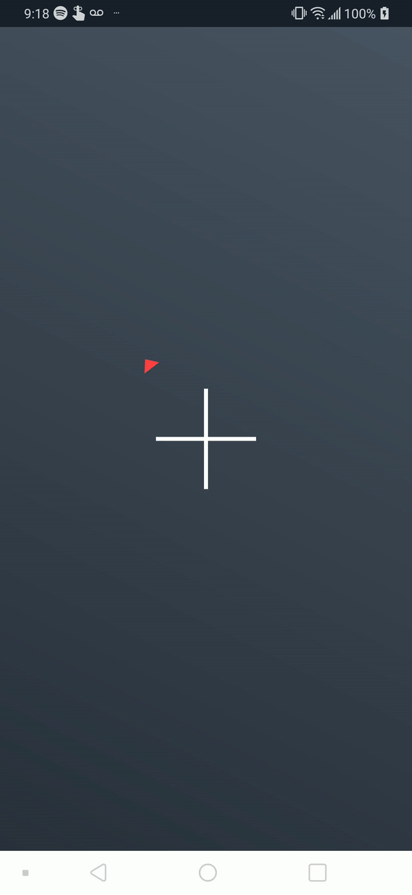

# Daily app day #9: Compass app

A simple compass app. Decided to switch things up and use sensors I've never used before. The carat 
points north.

I developed this indoors and I'm not 100% sure which way is north, but it
points the same way every time at least.

## What I learned:

 - How to work with the SensorManager + Accelerometer + Magnetometer

 - Smooth interpolation of rotations

